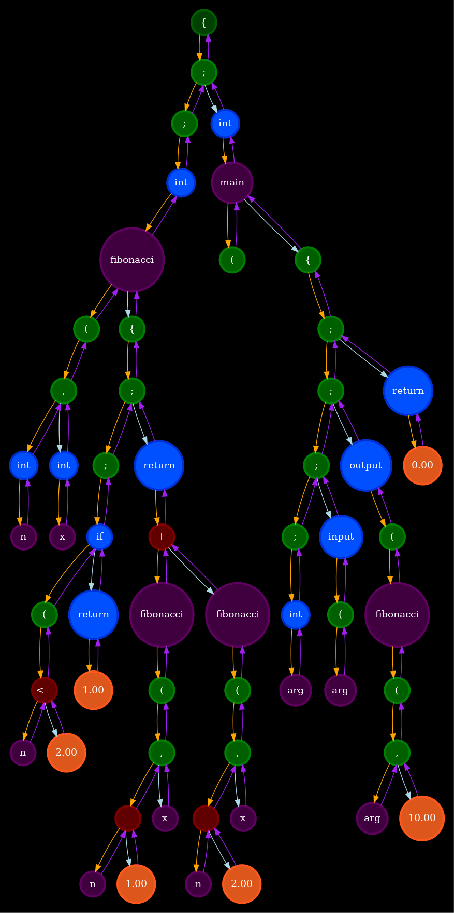

# CustomCompiler

## 1. Annotation

**Goal of the lab**: write custom programming language and compiler that transforms source code into NASM assembly language[<sup>[1]</sup>](#reference-1) or into custom made assembler for my other project: processor emulator[<sup>[2]</sup>](#reference-2). At the moment, we will only discuss transforming into NASM as it is more interesting and more complicated to implement.

## 2. Theory.

### 2.1 Tokens in programming language
Every programming language consists of keywords. This particular table is taken from wikipedia page on that topic[<sup>[3]</sup>](#reference-3)

[//]: # (this html code is taken from wikipedia page)

<details>
<summary>Click to view table</summary>
<table class="wikitable">
    <caption>Examples of common tokens
    </caption>
    <tbody><tr>
    <th>Token name
    <p>(Lexical category)
    </p>
    </th>
    <th>Explanation</th>
    <th>Sample token values
    </th></tr>
    <tr>
    <td><a href="/wiki/Identifier_(computer_languages)" title="Identifier (computer languages)">identifier</a></td>
    <td>Names assigned by the programmer.</td>
    <td><code class="mw-highlight mw-highlight-lang-text mw-content-ltr" style="" dir="ltr">x</code>, <code class="mw-highlight mw-highlight-lang-text mw-content-ltr" style="" dir="ltr">color</code>, <code class="mw-highlight mw-highlight-lang-text mw-content-ltr" style="" dir="ltr">UP</code>
    </td></tr>
    <tr>
    <td><a href="/wiki/Reserved_word" title="Reserved word">keyword</a></td>
    <td>Reserved words of the language.</td>
    <td><code class="mw-highlight mw-highlight-lang-c mw-content-ltr" style="" dir="ltr"><span class="k">if</span></code>, <code class="mw-highlight mw-highlight-lang-c mw-content-ltr" style="" dir="ltr"><span class="k">while</span></code>, <code class="mw-highlight mw-highlight-lang-c mw-content-ltr" style="" dir="ltr"><span class="k">return</span></code>
    </td></tr>
    <tr>
    <td><a href="/wiki/Delimiter" title="Delimiter">separator/punctuator</a></td>
    <td>Punctuation characters and paired delimiters.</td>
    <td><code>}</code>, <code>(</code>, <code>;</code>
    </td></tr>
    <tr>
    <td><a href="/wiki/Operator_(computer_programming)" title="Operator (computer programming)">operator</a></td>
    <td>Symbols that operate on arguments and produce results.</td>
    <td><code class="mw-highlight mw-highlight-lang-c mw-content-ltr" style="" dir="ltr"><span class="o">+</span></code>, <code class="mw-highlight mw-highlight-lang-c mw-content-ltr" style="" dir="ltr"><span class="o">&lt;</span></code>, <code class="mw-highlight mw-highlight-lang-c mw-content-ltr" style="" dir="ltr"><span class="o">=</span></code>
    </td></tr>
    <tr>
    <td><a href="/wiki/Literal_(computer_programming)" title="Literal (computer programming)">literal</a></td>
    <td>Numeric, logical, textual, and reference literals.</td>
    <td><code class="mw-highlight mw-highlight-lang-c mw-content-ltr" style="" dir="ltr"><span class="nb">true</span></code>, <code class="mw-highlight mw-highlight-lang-c mw-content-ltr" style="" dir="ltr"><span class="mf">6.02e23</span></code>, <code class="mw-highlight mw-highlight-lang-c mw-content-ltr" style="" dir="ltr"><span class="s">"music"</span></code>
    </td></tr>
    <tr>
    <td><a href="/wiki/Comment_(computer_programming)" title="Comment (computer programming)">comment</a></td>
    <td>Line or block comments. Usually discarded.</td>
    <td><code class="mw-highlight mw-highlight-lang-c mw-content-ltr" style="" dir="ltr"><span class="cm">/* Retrieves user data */</span></code>, <code class="mw-highlight mw-highlight-lang-c mw-content-ltr" style="" dir="ltr"><span class="c1">// must be negative</span></code>
    </td></tr>
    <tr>
    <td><a href="/wiki/Whitespace_character" title="Whitespace character">whitespace</a></td>
    <td>Groups of non-printable characters. Usually discarded.</td>
    <td>–
    </td></tr></tbody></table>
</details>    

</br>

### 2.2 Backus-Naur form
Also, it's important to know how to turn list of those lexemes into something useful. We can overcome this difficulty using Backus-Naur form (also called Backus normal form)[<sup>[4]</sup>](#reference-4). Main idea is to have a list of rules that describe how every language construction looks like and of what subelements it consists. Example from wikipedia page:

</br>

<details>
<summary>Click to view example</summary>

<pre><span></span><span class="p">&lt;</span><span class="nc">postal-address</span><span class="p">&gt;</span> <span class="o">::=</span> <span class="p">&lt;</span><span class="nc">name-part</span><span class="p">&gt;</span> <span class="p">&lt;</span><span class="nc">street-address</span><span class="p">&gt;</span> <span class="p">&lt;</span><span class="nc">zip-part</span><span class="p">&gt;</span>

    <span class="p">&lt;</span><span class="nc">name-part</span><span class="p">&gt;</span> <span class="o">::=</span> <span class="p">&lt;</span><span class="nc">personal-part</span><span class="p">&gt;</span> <span class="p">&lt;</span><span class="nc">last-name</span><span class="p">&gt;</span> <span class="p">&lt;</span><span class="nc">opt-suffix-part</span><span class="p">&gt;</span> <span class="p">&lt;</span><span class="nc">EOL</span><span class="p">&gt;</span> | <span class="p">&lt;</span><span class="nc">personal-part</span><span class="p">&gt;</span> <span class="p">&lt;</span><span class="nc">name-part</span><span class="p">&gt;</span>

<span class="p">&lt;</span><span class="nc">personal-part</span><span class="p">&gt;</span> <span class="o">::=</span> <span class="p">&lt;</span><span class="nc">first-name</span><span class="p">&gt;</span> | <span class="p">&lt;</span><span class="nc">initial</span><span class="p">&gt;</span> "."

<span class="p">&lt;</span><span class="nc">street-address</span><span class="p">&gt;</span> <span class="o">::=</span> <span class="p">&lt;</span><span class="nc">house-num</span><span class="p">&gt;</span> <span class="p">&lt;</span><span class="nc">street-name</span><span class="p">&gt;</span> <span class="p">&lt;</span><span class="nc">opt-apt-num</span><span class="p">&gt;</span> <span class="p">&lt;</span><span class="nc">EOL</span><span class="p">&gt;</span>

     <span class="p">&lt;</span><span class="nc">zip-part</span><span class="p">&gt;</span> <span class="o">::=</span> <span class="p">&lt;</span><span class="nc">town-name</span><span class="p">&gt;</span> "," <span class="p">&lt;</span><span class="nc">state-code</span><span class="p">&gt;</span> <span class="p">&lt;</span><span class="nc">ZIP-code</span><span class="p">&gt;</span> <span class="p">&lt;</span><span class="nc">EOL</span><span class="p">&gt;</span>

<span class="p">&lt;</span><span class="nc">opt-suffix-part</span><span class="p">&gt;</span> <span class="o">::=</span> "Sr." | "Jr." | <span class="p">&lt;</span><span class="nc">roman-numeral</span><span class="p">&gt;</span> | ""
  <span class="p">&lt;</span><span class="nc">opt-apt-num</span><span class="p">&gt;</span> <span class="o">::=</span> "Apt" <span class="p">&lt;</span><span class="nc">apt-num</span><span class="p">&gt;</span> | ""
</pre>
</details>

### 2.3 Assembly language

It would be really helpful, if you knew a little bit of assembly, as we will be working with it later in the text [<sup>[5]</sup>](#reference-5).

<!-- It's important to understand, that assembly language is completely different from any other language, as it's a low-level programming language, so it almost doesn't have any abstractions. For example, there are no while or for loops, if statements, arrays, structures, input and output functions. Instead you have to declare sequences of bytes directly in memory all by yourself, create labels and jumps to imitate ifs and loops, make syscalls (system calls) to your operating system in order to input/output data or halt the program.

Also it's very difficult to debug and develop your code, because even small and simple programs tend to have huge assembly code. In addition, it's almost impossible to use debug-output (debug-logging or debug-printing) technique, which is really inconvenient. More over, assembly is even more dangerous than C language, as it's very easy to get access to unprotected memory or to make some syscall that can do nasty things to your system.

On the other hand, a low level allows you to have more control and speed for your program. -->

### 2.4 Other

* Linked list[<sup>[6]</sup>](#reference-6) data structure. Allows you to quickly insert and erase elements, however search words in O(n) time.
* Stack frame[<sup>[7]</sup>](#reference-7) - concept from recursion implementation on low-level programming languages.
* AST (abstract syntax tree)[<sup>[8]</sup>](#reference-8) - tree structure that can conveniently represent commands (lexemes or tokens) from source file.
* Calling conventions[<sup>[9]</sup>](#reference-9) - there are different ways to pass arguments to function and receive it's result.

## 3. Tools

```bash
$ g++ --version
g++ (Ubuntu 11.4.0-1ubuntu1~22.04) 11.4.0
$ make --version
GNU Make 4.3
Built for x86_64-pc-linux-gnu
```

### 3.1 Graphviz[<sup>[10]</sup>](#reference-10)

That's a powerful tool that allows you to visualize your graphs. You can choose different geometric primitives for vertices, style of edges also can be specified. And what's really convenient is that graphviz tries to draw graph in a "simple" way, so that it is as close to planar graph as possible - that means it tries to minimize number of edge intersections. I've used this tool to dump AST. 

### 3.2 Radare2[<sup>[11]</sup>](#reference-11)[<sup>[12]</sup>](#reference-12)

This tool was used to debug recursion. It's an amazing tool, that allows you to debug directly from terminal, also there's a dump of current stack and registers state, which is really convenient. Also it's able to draw functions calls graph.

## 3. Project structure

### 3.1 Folders

Translation into assembly language happens in multiple stages, almost every stage has it's own folder (some kind of module) which can be run independently. Modules communicate by simple text files. Each module takes input from text file (that's a result from previous module), than it processes data somehow and after that, saves it to another text file.

* **common** - define templates that check errors + lexemes types struct
* **external** - contains submodules
    + **external/LoggerLib** - my library for logging[<sup>[13]</sup>](#reference-13).
    + **external/SPUprocessorEmulator** - processor emulator project (I've already mentioned it).
* **LexemsRealizations** - very important **Lexem** structure + it's methods. Also codegen for every lexeme: enum name + string representation.
* **LexemAnalysator** - module, takes source file with C code, parses it into an array of lexems
* **Syntax Tree** - binary tree, where each node contains some lexeme.
* **Dumper** - dumper that can output string representation of syntax tree or show it's image. Mainly is used for debug, however image is pretty informative.
* **Syntax Analysator** - module, takes an array of lexemes and constructs AST.
* **SemanticChecker** - checks that identifiers (variable and functions names) are used correctly. Checks that there are no duplications of names in declarations (there's a small flaw - it checks in the whole code and not just identifier's scope of view)
* **IntermediateRepresentation** - module, takes AST and constructs an array of tokens from custom.
* **GenAsmForMyProcessor** - takes an array of intermediate representation language tokens and generates my custom assembler code or NASM.

## 3.2 How to run?

There's one main Makefile in the root of the project and in the folder of each module.

Main Makefile targets and their purpose:
* **genSourceCode** - runs modules consequently and then generates assembler code
* **runNasm** - simply runs **nasm** compiler, compiles nasm source file and then executes it
* **runMyAsm** - **SPUprocessorEmulator** is used, first it parses custom assembler and creates intermediate binary file with parsed tokens for processor. Then, custom processor executes script.
* **clean** - cleans building directory (where binary files are contained)

Also, it's important to load submodules correctly. 
1. Make sure to run:

```bash
cd external/LoggerLib
make install
```

It will simply load dynamic library and update your path (don't be scared of password request, you can always look into makefile).

2. Make sure to run:

```bash
cd external/SPUprocessorEmulator/external/StackStruct
make install
```

This will generate static library that **SPUprocessorEmulator** uses. Also there maybe problems with canary protection, so you may need to disable it by commenting defines in stack include files. Strings that you need to comment look like this:

```C++
#define IS_CANARY_PROTECTION_ON
#define IS_HASH_MEMORY_CHECK_DEFINE
```

## 4. Process of code generation

Task assignment allowed to make your own custom programming language, however I didn't have much imagination, so I've tried to implement C-like language.

### 4.1 Lexemes struct

This section is mainly connected with **LexemsRealizations** module.

**LexemType** structure:
```C++
enum LexemType {
    INVALID_LEXEM_TYPE       = 0,
    CONST_LEXEM_TYPE         = 1,
    IDENTIFICATOR_LEXEM_TYPE = 2,
    KEYWORD_LEXEM_TYPE       = 3,
    DELIM_LEXEM_TYPE         = 4,
    OPERATOR_LEXEM_TYPE      = 5,
};
```

There's **Lexems** enum - it contains more specific lexeme name. For example, there's **KEYWORD_LEXEM_TYPE**, however it contains **while**, **if**, **return** and other lexemes. It's initialized with code generation, that is located in **LexemsRealizations/include/codeGen**. There are 3 files, they divide lexemes by their type. Each file contains of lexemes (enum name + string representation). Examples of defines:

```C++
DELIM_LEXEM_DEF(DELIMS_CLOSE_SIMPLE_BRACKET_LEXEM,      ")")
KEYWORD_LEXEM_DEF(KEYWORD_WHILE_LEXEM,      "while")
```

It basically represents all common token types in C language.

**Lexem** structure:
```C++
struct Lexem {
    LexemType    type;              // what type lexeme belongs to
    char*        strRepr;           // string representation of lexeme
    union {
        Lexems   lexemSpecificName; // more specific lexeme name
        double   doubleData;        // just number
    };
};
```

### 4.2 LexemsAnalysator

It's purpose is to make work for next module (**SyntaxAnalysator**) easier. We don't want to deal with strings, so instead we want to parse them somehow and turn into convenient structure.

First file is read into one string. Then it's wrapped in "{}" brackets, so that we can write code outside functions scope. After that, string is processed in for loop. Each new symbol is added to **tmpString** buffer. If current char is natural delimiter (" \n\t" -> space, new line, tabulation) or language delimiter (",{}();", comma, brackets and semicolon) than we try to convert **tmpString** into token.

<details>
<summary>lexeme analysator dump</summary>

```
--------------------------
lexem analysator:
[analysator->sourceFilePath : source.txt] 
[analysator->destFilePath : dest.txt] 
[analysator->arrLen : 68] 
[analysator->inputString : {
int fibonacci(int n, int x) {
    if (n <= 2)
        return 1;

    return fibonacci(n - 1, x) + fibonacci(n - 2, x);
}

int main() {
    int arg;
    input(arg);
    output(fibonacci(arg, 10));

    return 0;
}

}
] 
[analysator->inputStringLen : 218] 
array: 
[i : 0] [lexemType : DELIM_LEXEM_TYPE] [line : {] 
[i : 1] [lexemType : KEYWORD_LEXEM_TYPE] [line : int] 
[i : 2] [lexemType : IDENTIFICATOR_LEXEM_TYPE] [line : fibonacci] 
[i : 3] [lexemType : DELIM_LEXEM_TYPE] [line : (] 
[i : 4] [lexemType : KEYWORD_LEXEM_TYPE] [line : int] 
[i : 5] [lexemType : IDENTIFICATOR_LEXEM_TYPE] [line : n] 
[i : 6] [lexemType : DELIM_LEXEM_TYPE] [line : ,] 
[i : 7] [lexemType : KEYWORD_LEXEM_TYPE] [line : int] 
[i : 8] [lexemType : IDENTIFICATOR_LEXEM_TYPE] [line : x] 
[i : 9] [lexemType : DELIM_LEXEM_TYPE] [line : )] 
[i : 10] [lexemType : DELIM_LEXEM_TYPE] [line : {] 
[i : 11] [lexemType : KEYWORD_LEXEM_TYPE] [line : if] 
[i : 12] [lexemType : DELIM_LEXEM_TYPE] [line : (] 
[i : 13] [lexemType : IDENTIFICATOR_LEXEM_TYPE] [line : n] 

```
</details>

### 4.3 SyntaxAnalysator

This module takes an array of lexemes and transforms it into AST. We do this, because tree representation is most convenient. Tree structure looks like this: each node is usually some kind of operation (addition, division and etc.) and it's 2 children are operands that are defined recursively as they can be more complex than a simple number (function call for example). However, I've decided that it will be helpful to use delimiters lexemes as nodes too:
* Semicolon (";"). Connects subtrees that correspond to consequent lines of code (or instructions, if they are placed on one line).
* Comma (","). Connects arguments of function or variables in declaration
* Open simple bracket ("("). Usually it's subtree represents list of arguments for function, but it's also is used to state operands priority.
* Open curly bracket ("{"). It's subtree represents block of code.

#### 4.3.1 Recursive tree generation

As I've already mentioned tree is constructed with usage of Backus-Naur form. I've implemented it in such way: each function tries to parse current lexeme based on some rule (if statement, variable declaration or function call). Than, to parse subelements corresponding function is called. It's important to call those functions in right order. The higher parsing rule priority is, the deeper it is on recursion level. Functions that I've used and their order:

<details>
<summary>parsers of rules</summary>

```C++
static SyntaxAnalysatorErrors parseGrammar(SyntaxAnalysator* analysator);
static SyntaxAnalysatorErrors parseBlockOfCode(SyntaxAnalysator* analysator);
static SyntaxAnalysatorErrors parseSingleCommandLine(SyntaxAnalysator* analysator);

static SyntaxAnalysatorErrors parseVariablesDeclaration(SyntaxAnalysator* analysator);
static SyntaxAnalysatorErrors parseWhileLoop(SyntaxAnalysator* analysator);
static SyntaxAnalysatorErrors parseIfKeyword(SyntaxAnalysator* analysator);
static SyntaxAnalysatorErrors parseInputKeyword(SyntaxAnalysator* analysator);
static SyntaxAnalysatorErrors parseOutputKeyword(SyntaxAnalysator* analysator);

static SyntaxAnalysatorErrors parseReturnKeyword(SyntaxAnalysator* analysator);
static SyntaxAnalysatorErrors parseFunctionDeclaration(SyntaxAnalysator* analysator);
static SyntaxAnalysatorErrors parseFunctionCall(SyntaxAnalysator* analysator);

// no functions that are called inside boolean condition, only vars, consts and simple identificators
static SyntaxAnalysatorErrors parseBooleanCondition(SyntaxAnalysator* analysator);

static SyntaxAnalysatorErrors parseAssignOperator(SyntaxAnalysator* analysator);
static SyntaxAnalysatorErrors parseLogicOrOperator(SyntaxAnalysator* analysator);
static SyntaxAnalysatorErrors parseLogicAndOperator(SyntaxAnalysator* analysator);
static SyntaxAnalysatorErrors parseCompareOperator(SyntaxAnalysator* analysator);
static SyntaxAnalysatorErrors parseAdditionSubtractionOperators(SyntaxAnalysator* analysator);
static SyntaxAnalysatorErrors parseMultiplicationDivisionOperators(SyntaxAnalysator* analysator);
static SyntaxAnalysatorErrors parseSimpleBracketDelim(SyntaxAnalysator* analysator);
static SyntaxAnalysatorErrors parseTerminal(SyntaxAnalysator* analysator);

```
</details>

That's not the most handy approach (in terms of debugging and adding new parsing rules). In the future, I want to come up with a different implementation, where it would be possible to state rules in Backus-Naur form directly in file and to use some kind of common structure - not to have so many functions.

Recursion works as follows: each parsing rule is tested, if it's function complets successfully, than we parsed lexemes correctly, otherwise, if error was raised, we try different parsing function. However, such approach doesn't allow us to detect errors were easily - because we don't know, whether we chose wrong parsing function or it's a real syntax error.

To check if current lexem is equal to expected one following define is used:

```C++
#define REQUIRE_LEXEM(lexem) \
    IF_NOT_COND_RETURN(isCurLexem_##lexem(analysator),                          SYNTAX_ANALYSATOR_INVALID_ARGUMENT)

// usage example:
REQUIRE_LEXEM(DELIMS_CLOSE_CURLY_BRACKET_LEXEM);
REQUIRE_LEXEM(KEYWORD_INT_LEXEM);
```

#### 4.3.2 Syntax tree dumper

<!-- <details>
<summary>AST example for fibonacci function</summary>


</details> -->

AST example for fibonacci function


Each lexeme type is highlighted in it's own color for better visual perception. Also there are different parameters that define what will be shown on the picture:

<details>
<summary>dumper settings structures</summary>

```C++
struct NodesWithColor {
    const char* color;
    const char* borderColor;
    size_t      numOfNodes;
    size_t*     nodes;
};

struct Lexem2stringSettings {
    bool isLexemTypeNeeded;
    bool isBracketsNeeded;
};

struct DumperSettings {
    const NodesWithColor* coloringRule;
    size_t                coloringRuleLen;
    bool                  isMemIndexesInfoNeeded;
    Lexem2stringSettings  lexem2stringSettings;
};
```
</details>

## 5. Intermediate representation (IR)

It's used to reduce ammount of copypasted code, because we perform almost same manipulations when we convert code to NASM and my custom asm. I've chose simple stack IR. That means that every instruction (command) expects to get it's arguments from stack and it will put result of operation also on stack. Of course, that's not the fastest approach, but we don't need to deal with complex register allocation[<sup>[14]</sup>](#reference-14).

<details>
<summary>IntermidRepr structures</summary>

```C++
union IntermidReprCommandArgument {
    int                 jumpDestLabelInd;
    size_t              variableInd;
    double              doubleNumber;
    int                 intNumber;
    const char*         functionName;
};

struct IntermidReprCommand {
    IntermidReprCommandType     commandType;
    IntermidReprCommandArgument argument;
};

struct IntermidReprLabel {
    size_t labelInd;
};

struct IntermidReprElement {
    bool   isCommand;
    size_t depthInBlocksOfCode;
    union {
        IntermidReprCommand command;
        IntermidReprLabel   label;
    };
    IntermidReprElement* prevElement;
    IntermidReprElement* nextElement;
};

struct LocalVarsListNode {
    char*              name;
    LocalVarsListNode* prev;
};

struct FunctionRepr {
    size_t                  numOfElements;
    int                     numOfLocalVars;
    int                     numOfArguments;
    char*                   functionName;
    IntermidReprElement*    listHead; // pointer to the head of linked list
    IntermidReprElement*    listTail; // pointer to the tail of linked list
    LocalVarsListNode*      localVarsListTail;
    FunctionRepr*           prevFunc;          
    FunctionRepr*           nextFunc;        
    // TODO: return type, for now it's just int
};

struct IntermidRepr {
    const char*      sourceFilePath;
    FunctionRepr*    funcReprListHead; // pointer to the head of linked list
    FunctionRepr*    funcReprListTail; // pointer to the tail of linked list
    SemanticChecker  checker;
    SyntaxTree       tree;
};
```
</details>

Intermediate representation struct contains semantic checker, syntax tree and doubly linked list of functions. Each function contains doubly linked list of commands from that function's body.

IR example lies in **IntermediateRepresentation/dest.txt**:

<details>
<summary>IR example for fibonacci function</summary>

```text
fibonacci(int, int):
	enter 2
	paramOut @0
	paramOut @1
	push @0
	push 2.000
	lessOrEqCmp
	push 0.000
	je fibonacci_L0
	push 1.000
	leave
	return
	fibonacci_L0:
	push @1
	push @0
	push 1.000
	sub
	call fibonacci
	push @1
	push @0
	push 2.000
	sub
	call fibonacci
	add
	leave
	return

main():
	enter 1
	input
	pop @0
	push 10.000
	push @0
	call fibonacci
	output
	output
	push 0.000
	leave
	return
```
</details>
</br>

```text
push @0
```

That's an example of variable usage. "@" - states that we deal with variable, index after it - local variable index.

```
fibonacci_L0:
```

Example of label. It's constructed as follows:
```<function_name> + "_L" + <label_ind>```

```
input
output
```

These instructions are used accordingly to input and output data. For now they can only output integers (as there's no other data type implemented).

```
enter <num_of_local_vars>
leave
```

These instructions are used to implement recursion, when function is called, ```enter <num_of_local_vars>``` instruction allocates space for local variable (that doesn't include function arguments as they are already in stack), in other words, stack frame is created. Before function exit ```leave``` instruction is called - it "frees" allocated memory, i.e.removes current stack frame.

## 6. Assembler language generation

There are two generators of assembly code, for now we will focus only on NASM one.

### 6.1 Common binary operations

As our commands work with stack and asm expect command to work with registers we will have to do some additional work: take values from stack and save them in registers, perform operation, put result back into stack. There many binary operations, so here's a handy define:

<details>
<summary>binary operation define</summary>

```C++
#define COMMON_BIN_OP_CODE(commandName)            \
        ADD_LINE_IMPL("pop  rbx\n");               \
    ADD_TAB_LINE_IMPL("pop  rax\n");               \
    ADD_TAB_LINE_IMPL(commandName " rax, rbx\n");  \
    ADD_TAB_LINE_IMPL("push rax\n");               \
    ADD_LINE_IMPL("\n");
```
</details>

To implement compare instruction from IR (such as ```lessOrEqCmp```), I've used ```setl, setg, setle, ...``` instructions:

<details>
<summary>compare operation define</summary>

```C++
// takes 2 arguments from stack, moves to registers rax, rbx
// then compares it using cmp instruction
// after that by using setxxx command we store boolean value (0 or 1) to the rcx
// and at the end we push this value back to the stack
// cmpCommandShortSuf \in {"l", "le", "g", "ge", "e"}
#define COMMON_CMP_DEF_CODE(cmpCommandShortSuf)  \
        ADD_LINE_IMPL("xor  rcx, rcx\n"               );    \
    ADD_TAB_LINE_IMPL("pop  rbx\n"                    );    \
    ADD_TAB_LINE_IMPL("pop  rax\n"                    );    \
    ADD_TAB_LINE_IMPL("cmp  rax, rbx\n"               );    \
    ADD_TAB_LINE_IMPL("set" cmpCommandShortSuf " cl\n");    \
    ADD_TAB_LINE_IMPL("push rcx\n"                    );    \
        ADD_LINE_IMPL("\n");
```
</details>

### 6.2 Recursion and function call

I've used cdecl[<sup>[15]</sup>](#reference-15) calling convention - that means that arguments to functions are passed through stack (first, last argument is pushed and at the end, first argument is pushed -> after all pushes first argument lies on top).

To implement recursion, I've implemented stack frames using ```enter, leave``` instructions.

To get access to local variable (not argument) ```mov rax, [rbp - 16]``` instruction is used, where 16 is actually (local var index + 1) * 8. Plus one is performed due to zero indexation, 8 is size of type (for now all variables have same size, so it's very easy to calculate offset).

To get access to function argument ```mov rax, [rbp + 16]``` instruction is used. 16 is actualy (2 + argumentIndex) * 8, argumentIndex is in zero indexation. We need to shift by 16 bytes as return address and old value of rbp is stored in stack.

### 6.3 Asm libraries

I've needed to somehow implement extern functions, such as print, output and halt (end the program), to do so, I've created additional asm files which are linked to the main one during compilation. They are located in **IntermediateRepresentation/asmLibs** folder.

* **myPrintfFunction** - takes one argument (integer) from stack and prints it. In the file other format specifiers are implemented, also multiple arguments are allowed, however there's only integer type for now, so there's no use in it.
* **readSingleInt** - reads till newline, doesn't read more than 10 symbols. Transforms string into decimal int and pushes result to stack
* **myHaltFunction** - takes one argument (integer) from stack - exit code, and finishes program with this code.
* **clearAndOutputBuffer** - print function is implemented with buffer - data is not printed immediately but instead stored into buffer to be outputed later - that way printing happens much faster (on large data). However, sometimes we need to get output right now, to do so, we just call this function (it can be considered as cout.flush() analogy from C++ language).

### 6.4 Asm code example

<details>
<summary>asm code for fibonacci function</summary>

```asm
section .data

singleIntFormatSpec db "%d", 10, 0

section .text
extern myPrintfFunction
extern readSingleInt
extern myHaltFunction
extern clearAndOutputBuffer
global _start

function_fibonacci:
	enter 0, 0
	
	
	push qword [rbp + 16]
	push 2
	xor  rcx, rcx
	pop  rbx
	pop  rax
	cmp  rax, rbx
	setle cl
	push rcx

	push 0
	
	pop rbx
	pop rax
	cmp rax, rbx
	je fibonacci_L0

	push 1
	pop  rax
	leave
	pop  rbx
	add  rsp, 16
	push rax
	push rbx
	ret
	fibonacci_L0:
	push qword [rbp + 24]
	push qword [rbp + 16]
	push 1
	pop  rbx
	pop  rax
	sub  rax, rbx
	push rax

	call function_fibonacci
	push qword [rbp + 24]
	push qword [rbp + 16]
	push 2
	pop  rbx
	pop  rax
	sub  rax, rbx
	push rax

	call function_fibonacci
	pop  rbx
	pop  rax
	add  rax, rbx
	push rax

	pop  rax
	leave
	pop  rbx
	add  rsp, 16
	push rax
	push rbx
	ret
_start:
	enter 8, 0
	call readSingleInt
	pop  qword [rbp + -8]
	push 10
	push qword [rbp + -8]
	call function_fibonacci
	push singleIntFormatSpec
	call myPrintfFunction
	push singleIntFormatSpec
	call myPrintfFunction
	push 0
	pop  rax
	leave
	push rax
	call myHaltFunction

```

</details>

## 7. References

<a id="reference-1"></a>
1. [**^**](https://en.wikipedia.org/wiki/Netwide_Assembler) Wikipedia page about NASM assembly language.
<a id="reference-2"></a>
2. [**^**](https://github.com/Kunakbaev/SPUprocessorEmulator) Project, written in C language, where I've implemented a simple processor emulator that can execute custom-made assembler.
<a id="reference-3"></a>
3. [**^**](https://en.wikipedia.org/wiki/Lexical_analysis#Lexical_token_and_lexical_tokenization) Table with common tokens in programming languages.
<a id="reference-4"></a>
4. [**^**](https://en.wikipedia.org/wiki/Backus%E2%80%93Naur_form#cite_note-janikow2-1) Backus-Naur form.
<a id="reference-5"></a>
5. [**^**](https://metanit.com/assembler/nasm/) NASM guide in russian.
<a id="reference-6"></a>
6. [**^**](https://en.wikipedia.org/wiki/Linked_list) Linked list data structure.
<a id="reference-7"></a>
7. [**^**](https://people.cs.rutgers.edu/~pxk/419/notes/frames.html) Stack frame explanation.
<a id="reference-8"></a>
8. [**^**](https://en.wikipedia.org/wiki/Abstract_syntax_tree) AST (abstract syntax tree)
<a id="reference-9"></a>
9. [**^**](https://en.wikipedia.org/wiki/Calling_convention) Calling conventions.
<a id="reference-10"></a>
10. [**^**](https://graphviz.org/) Graphviz graphs visualization tool.
<a id="reference-11"></a>
11. [**^**](https://en.wikipedia.org/wiki/Radare2) Wikipedia page about Radare2 (r2) debugging tool.
<a id="reference-12"></a>
12. [**^**](https://www.radare.org/n/radare2.html) Official Radare2 page.
<a id="reference-13"></a>
13. [**^**](https://github.com/Kunakbaev/LoggerLib) My Logger lib.
<a id="reference-14"></a>
14. [**^**](https://en.wikipedia.org/wiki/Register_allocation) Registers allocation
<a id="reference-15"></a>
15. [**^**](https://en.wikipedia.org/wiki/X86_calling_conventions#cdecl) Cdecl calling convention
